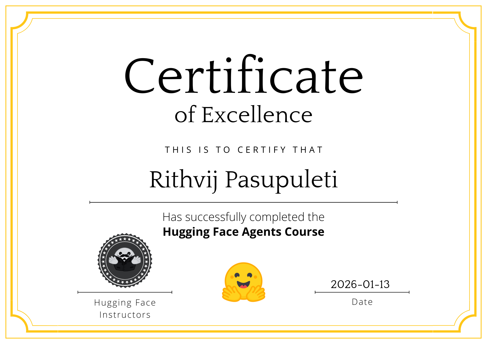

# Hugging-Face-GAIA-AI-Agent
# GAIA Agent — LangGraph + LangChain

This repository contains a **tool-augmented ReAct-style agent** built for the **GAIA benchmark**, implemented using **LangGraph**, **LangChain**, **Google Gemini**, and **OpenAI** models.

The agent achieved a **~70% score on the GAIA benchmark**, demonstrating effective multi-step reasoning, structured tool usage, and robust orchestration across modalities.

---

## Models Used

The solution routes tasks across multiple LLMs based on determinism and capability requirements:

- **Gemini-2.0-flash**
  - Fast reasoning
  - DataFrame querying
  - File-based QA
  - Code generation

- **GPT-4.1-mini**
  - Deterministic reasoning
  - Strict output formatting
  - Final answer normalization

---

## High-Level Architecture

The agent follows a **ReAct-style loop** implemented with **LangGraph**.

**Core building blocks:**

- **State** – Shared execution memory across nodes
- **LLM + Tools** – Reasoning engine with external capabilities
- **StateGraph** – Explicit control flow
- **BasicAgent** – Execution wrapper
- **Batch Orchestrator** – GAIA question retrieval and submission

---

## Agent Control Flow
START --> assistant (LLM reasoning) --> tool execution (if required) --> assistant --> final_answer (normalization) --> END

This loop continues until the agent determines a final answer is ready.

---

## State Management

A shared **TypedDict-based state** acts as the single source of truth and includes:

- Conversation history (LLM + tool messages)
- File paths and metadata
- Intermediate tool outputs
- Final processed response

This enables traceable, reproducible execution across the agent lifecycle.

---

## Implemented Tools (Core Overview)

### Data & File Reasoning
- **AnswerExcelTool** – Queries Excel files via a Pandas agent
- **AnswerQuestionFromFileTool** – QA over PDFs and images (base64 input)
- **DownloadFileTool** – Downloads and persists files for downstream tools

### Reasoning & Code
- **AnswerQuestionTool** – Handles self-contained reasoning tasks
- **CodeGenTool** – Generates Python functions from structured specifications
- **PythonExecutionTool** – Executes isolated Python code in a subprocess

### Web & Knowledge
- **WebSearchTool (Tavily)** – Up-to-date factual web search
- **FetchWebPageTool** – Retrieves full webpage content
- **WikipediaTool** – Extracts and cleans Wikipedia HTML
- **YouTubeTranscriptTool** – Fetches and aggregates video transcripts

### Audio & Vision
- **AudioTool** – Transcribes audio with Whisper and answers queries
- **ChessTool** – Predicts best chess move from board images using Stockfish

### Utility
- **ReverseStringTool** – Simple text transformation utility

---

## Final Answer Normalization

Before submission, answers are passed through a **final normalization step** to:

- Remove intermediate reasoning
- Enforce strict output formats
- Ensure compliance with GAIA evaluation rules

This significantly reduces malformed or verbose submissions.

---

## Results

- **Benchmark:** GAIA
- **Score:** ~70%
- **Key Strengths:**
  - Explicit control flow with LangGraph
  - Robust tool routing
  - Multi-modal reasoning (text, tables, audio, images)
  - Deterministic final answers

---

## Tech Stack

- LangGraph
- LangChain
- Google Gemini (gemini-2.0-flash)
- OpenAI (gpt-4.1-mini)
- Python
- Whisper
- Stockfish
- Tavily Search

---

## Design Notes

This implementation prioritizes:
- Explicit state and control flow over implicit agent loops
- Tool-first reasoning over pure text generation
- Deterministic, evaluation-safe outputs

It is designed specifically for **benchmark-driven environments** such as GAIA rather than conversational chat use cases.

## Installation
**1. Clone the repository**
``git clone <repository-url>
cd <repository-name>``

**2. Set up Python virtual environment**
For MacOS
``python -m venv .venv
source .venv/bin/activate``

For Windows -
``python -m venv .venv
.\.venv\Scripts\activate``

**3. Install dependencies**
``pip install -r requirements.txt``

**4. Configure environment variables**

For Unix / macOS

``export HF_TOKEN="your_huggingface_token"
export OPENAI_API_KEY="your_openai_api_key"
export GEMINI_API_KEY="your_gemini_api_key"``

For Windows

``set HF_TOKEN=your_huggingface_token
set OPENAI_API_KEY=your_openai_api_key
set GEMINI_API_KEY=your_gemini_api_key``

**5. Run the application**
``python app.py``
